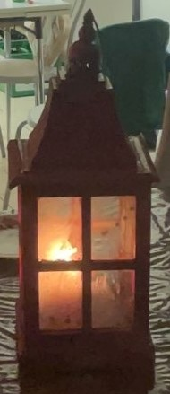

# De Rode Lantaarn

Er zijn regels.

## Definities

- **Grote rondes** De set wielerevenementen de Ronde van Frankrijk, de Ronde van Italië en de Ronde van Spanje.

- **Grote ronde** Een element uit de set grote rondes.

- **Deelnemers** De set mensen Daan, Daan, Guy, Joran, Pim, Roel en Tom. 

- **Deelnemer** Een element uit de set deelnemers.

- **Veiling** Een gebeurtenis die unaniem door de deelnemers als veiling wordt erkend. Wordt aangeduid met een jaartal en een grote ronde. 

- **Verliezer** De deelnemer die unaniem door de deelnemers wordt uitgeroepen tot verliezer van een veilig. Wordt aangeduid met een jaartal en een grote ronde.

- **Verliezer(s)plaatjes** Stukje metaal met daarop gegraveerd:

    - Een jaartal
    - Een grote ronde
    - Een verliezer

zodanig dat het jaartal en de grote ronde van de veiling overeenkomen met het jaartal en de grote ronde van de verliezer. 

- **Alle verliezer(s)plaatjes** De set van alle verliezer(s)plaatjes die kunnen bestaan. 

- **Bijna alle verliezer(s)plaatjes** Alle verliezer(s)plaatjes waarbij 1 element mag ontbreken.

- **Rode lantaarn** Lantaar, rood van kleur. Aan de zijkant beplakt met bijna alle verliezer(s)plaatjes. Is altijd goed onderhouden en mooi om te zien.

- **Overdraging** Een gebeurtenis die unaniem door de deelnemers als overdraging wordt erkend waarbij een deelnemer de rode lantaarn fysiek in ontvangst neemt.

- **Rode lantaarn drager**: De laatste deelnemer die de rode lantaarn heeft ontvangen bij een overdraging.

## Regels

Als aan 1 of meer van de bovenstaande definities niet overeenkomt met de fysieke toestand van het universum is dat de schuld van de rode lantaarn drager. Dit geeft de rest van de deelnemers het recht om zonder weerstand vanuit de rode lantaarn drager een van de volgende handeling uit te voeren.

1. Naar de rode lantaarn drager wijzen en tegelijkertijd lachen, schelden, huilen en/of teleurgesteld kijken.
2. Een beetje onaardiger zijn dan onder normale omstandigheiden sociaal geaccepteerd.
3. Toch gewoon aardig doen en een beetje begrip tonen dat er meer is in het leven dan fietsen en fietsen kijken.

## Meta regels

Alle regels en definities mogen te allen tijden worden veranderd mits aan een van de volgende voorwaarden is voldaan:

1. De deelnemers zijn het er unaniem mee eens.
2. Een deelnemer was niet te beroerd om een beetje moeite te doen om de regels leuker te maken.

{ width=30% }